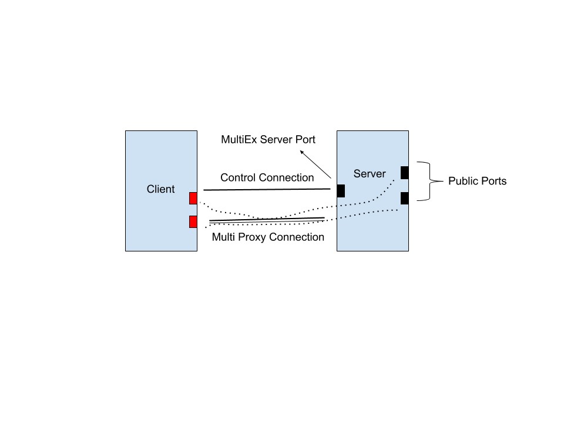

# Intro
MULTIEX is a user-friendly reverse proxy which exposes multi ports on multi local machines to a public host passing through NAT.**Only TCP supported currently**
# Design

<div align=center></div>

MultiEx server establishes one control connection and multi proxy connections. Control connection is used for receiving and accepting commands. As for proxy connection, every new request from public will have a “partner” proxy connection which means one proxy connection is responsible for one forwarding process.

# Usage

```bash
$ ./server -h    
Usage of ./server:
    -clientPort string
      	the port listening for MultiEx client. (default ":8070")
    -logLevel string
      	the log level of this program. (default "INFO")
    -logTo string
      	the location where logs save. Empty value and stdout have special meaning (default "stdout")
    -token string
      	Token is the credential client should hold to connect this server.Server doesn't have token default.

$ ./client -h                          
Usage of ./client:
  -logLevel string
    	the log level of this program. (default "INFO")
  -logTo string
    	the location where logs save. Empty value and stdout have special meaning (default "stdout")
  -portMap string
    	Port map represent mapping between host. e.g. '2222-22' represents expose local port 22 at public port 2222. Multi mapping split by comma. (default "2222-22")
  -remotePort string
    	the public server ip:port listening for "MultiEx" client.
  -token string
    	Token is the credential client should hold to connect server.Server doesn't have token default.

```

**1. Build executables inside 'cmd' folder**

**2. Start MultiEx server at public host**

```bash
$ ./server -token [your token]
```
**3. Start MultiEx client at local host behind NAT**

MultiEx listens at a port waiting for MultiEx client connect(Default is 8070).This port is not for mapping. So, set PortMap to map ports.

e.g.   
```bash
-portMap 2222-1800,2223-1100  
# access public port 2222/2223 to visit local port 1800/1100
# !!! Attention:PortMap is splited by '-'
```
```bash
$ ./client -remotePort [server public ip]:[MultiEX server port] -portMap 2222-1800,2223-1100 -token [your token]
```

**4. Set open files limit(Optional)**

```bash
$ ulimit -n 65535
```

